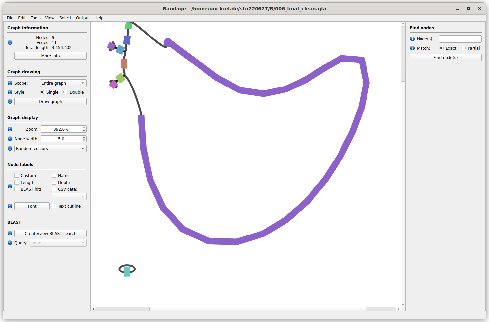
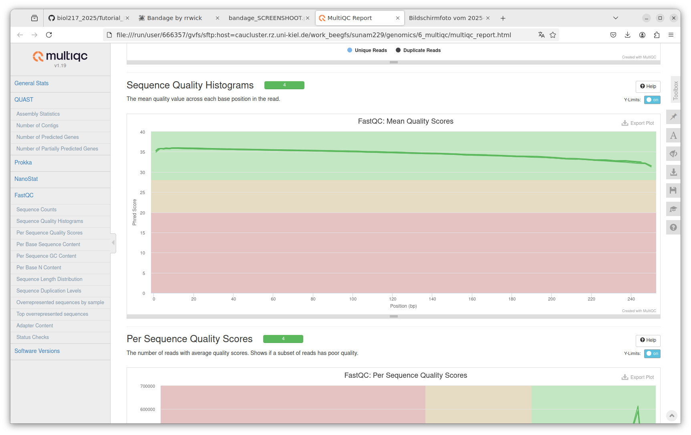

# day-5 protocol
## 20-01-2025


```bash
# go to work 
# go to genomics 
#for loop explaination and example:
#path: 
./work_beegfs/sunam229/genomics/0_raw_reads/short_reads/*gz 
#path to outputfolder
./work_beegfs/sunam229/genomics/0_raw_reads/output_fastqc


for i in ./add path/*.gz ; do fastqc $i -o ./ path to folder/output_dir/ -t 16; done 
# use the ; to stay in one line 

#dann:
squeue -u sunam229
sbatch template.sh
# used command :
#!/bin/bash
#SBATCH --nodes=1
#SBATCH --cpus-per-task=16
#SBATCH --mem=32G
#SBATCH --time=5:00:00
#SBATCH --job-name=01_fastqc
#SBATCH --output=01_fastqc.out
#SBATCH --error=01_fastqc.err
#SBATCH --partition=base
#SBATCH --reservation=biol217

module load gcc12-env/12.1.0
module load miniconda3/4.12.0
module load micromamba/1.4.2
eval "$(micromamba shell hook --shell=bash)"
cd $WORK
micromamba activate .micromamba/envs/01_short_reads_qc


# creata new folder for output of qc 
mkdir -p $WORK/genomics/0_raw_reads/output_fastqc
for i in $WORK/genomics/0_raw_reads/short_reads/*.gz ; do fastqc $i -o $WORK/genomics/0_raw_reads/output_fastqc -t 16; done

micromamba deactivate
jobinfo
# ##----------------- End -------------


#for fast p :
## 1.1 fastqc raw reads
# mkdir -p $WORK/genomics/1_short_reads_qc/1_fastqc_raw
# for i in *.gz; do fastqc $i -o $WORK/genomics/1_short_reads_qc/1_fastqc_raw -t 16; done

## 1.2 fastp 
mkdir -p $WORK/genomics/1_short_reads_qc/2_cleaned_reads
fastp -i $WORK/genomics/0_raw_reads/short_reads/241155E_R1.fastq.gz \
 -I $WORK/genomics/0_raw_reads/short_reads/241155E_R2.fastq.gz \
 -R $WORK/genomics/1_short_reads_qc/2_cleaned_reads/fastp_report \
 -h $WORK/genomics/1_short_reads_qc/2_cleaned_reads/report.html \
 -o $WORK/genomics/1_short_reads_qc/2_cleaned_reads/241155E_R1_clean.fastq.gz \
 -O $WORK/genomics/1_short_reads_qc/2_cleaned_reads/241155E_R2_clean.fastq.gz -t 6 -q 25

 #then check the quality with fastqc again :
 ## 1.3 fastqc cleaned
mkdir -p $WORK/genomics/1_short_reads_qc/3_fastqc_cleaned
for i in $WORK/genomics/1_short_reads_qc/2_cleaned_reads/*.gz; do fastqc $i -o $WORK/genomics/1_short_reads_qc/3_fastqc_cleaned -t 16; done
micromamba deactivate
echo "---------short read cleaning completed successfully---------"

#Answer the questions:
#How good is the read quality:
#how many reads before trimming and how many now:
#1639549/1639549 (before)  ;1613392/ 1613392 (after)
# did the quality of the reads improve after triming?
# no sequence flagged with poor quality ; 

#for the long reads: 
eval "$(micromamba shell hook --shell=bash)"
cd $WORK
micromamba activate .micromamba/envs/02_long_reads_qc

cd $WORK/genomics/0_raw_reads/long_reads/
NanoPlot --fastq $file -o $output_dir -t 6 --maxlength 40000 --minlength 1000 --plots kde --format png --N50 --dpi 300 --store --raw --tsv_stats --info_in_report
## 2.1 Nanoplot raw
cd $WORK/genomics/0_raw_reads/long_reads/
mkdir -p $WORK/genomics/2_long_reads_qc/1_nanoplot_raw
NanoPlot --fastq $WORK/genomics/0_raw_reads/long_reads/*.gz \
 -o $WORK/genomics/2_long_reads_qc/1_nanoplot_raw -t 16 \
 --maxlength 40000 --minlength 1000 --plots kde --format png \
 --N50 --dpi 300 --store --raw --tsv_stats --info_in_report

#for filtlong:
filtlong --min_length 1000 --keep_percent 90 $file1 | gzip > sample1_cleaned_filtlong.fastq.gz
mv sample1_cleaned_filtlong.fastq.gz $output_dir
#used one:
## 2.2 Filtlong
mkdir -p $WORK/genomics/2_long_reads_qc/2_cleaned_reads
filtlong --min_length 1000 --keep_percent 90 $WORK/genomics/0_raw_reads/long_reads/*.gz | gzip > $WORK/genomics/2_long_reads_qc/2_cleaned_reads/241155E_cleaned_filtlong.fastq.gz

# for Nanoplot again: 
NanoPlot --fastq $input_dir/file1_cleaned_filtlong.fastq.gz -o $output_dir -t 6 --maxlength 40000 --minlength 1000 --plots kde --format png --N50 --dpi 300 --store --raw --tsv_stats --info_in_report
#used one:
## 2.3 Nanoplot cleaned
cd $WORK/genomics/2_long_reads_qc/2_cleaned_reads
mkdir -p $WORK/genomics/2_long_reads_qc/3_nanoplot_cleaned
NanoPlot --fastq $WORK/genomics/2_long_reads_qc/2_cleaned_reads/*.gz \
 -o $WORK/genomics/2_long_reads_qc/3_nanoplot_cleaned -t 16 \
 --maxlength 40000 --minlength 1000 --plots kde --format png \
 --N50 --dpi 300 --store --raw --tsv_stats --info_in_report

 #answer question:
 #how good is tge wuality of the long reads?:
 #mean qual:  11.4 (before)  10.4 (after) 
 # how many reads before trimming and how many now?:
 #before: 15963 ; trimmed: 12446

 #for the unicycler:
 cd $WORK
micromamba activate .micromamba/envs/03_unicycler
unicycler -1 $short_read1 -2 $short_read2 -l $long_reads -o $output_dir -t 16
 # used one
echo "---------Unicycler Assembly pipeline started---------"
eval "$(micromamba shell hook --shell=bash)"
cd $WORK
micromamba activate .micromamba/envs/03_unicycler
cd $WORK/genomics
mkdir -p $WORK/genomics/3_hybrid_assembly
unicycler -1 $WORK/genomics/1_short_reads_qc/2_cleaned_reads/241155E_R1_clean.fastq.gz -2 $WORK/genomics/1_short_reads_qc/2_cleaned_reads/241155E_R2_clean.fastq.gz -l $WORK/genomics/2_long_reads_qc/2_cleaned_reads/241155E_cleaned_filtlong.fastq.gz -o $WORK/genomics/3_hybrid_assembly/ -t 16
micromamba deactivate
echo "---------Unicycler Assembly pipeline Completed Successfully---------"

# check assembly quality 
#for quast 
cd $WORK
micromamba activate .micromamba/envs/04_checkm_quast

quast.py assembly.fasta --circos -L --conserved-genes-finding --rna-finding\
     --glimmer --use-all-alignments --report-all-metrics -o $output_dir -t 16
#used one 
echo "---------Assembly Quality Check Started---------"
micromamba activate .micromamba/envs/04_checkm_quast
cd $WORK/genomics/3_hybrid_assembly
mkdir -p $WORK/genomics/3_hybrid_assembly/quast
quast.py $WORK/genomics/3_hybrid_assembly/assembly.fasta --circos -L --conserved-genes-finding --rna-finding \
 --glimmer --use-all-alignments --report-all-metrics -o $WORK/genomics/3_hybrid_assembly/quast -t 32
micromamba deactivate
#for checkM
micromamba activate .micromamba/envs/04_checkm
# Create the output directory if it does not exist
mkdir -p $checkm_out
# Run CheckM for this assembly
checkm lineage_wf $inputdir $output_dir -x fasta --tab_table --file $checkm_out/checkm_results -r -t 24
  
# Run CheckM QA for this assembly
checkm tree_qa ./$checkm_out
checkm qa ./$checkm_out/lineage.ms ./$checkm_out/ -o 1 > ./$checkm_out/Final_table_01.csv
checkm qa ./c$checkm_out/lineage.ms ./$checkm_out/ -o 2 > ./$checkm_out/final_table_checkm.csv
#used one 
## 4.2 CheckM
micromamba activate .micromamba/envs/04_checkm
cd $WORK/genomics/3_hybrid_assembly
mkdir -p $WORK/genomics/3_hybrid_assembly/checkm
checkm lineage_wf $WORK/genomics/3_hybrid_assembly/ $WORK/genomics/3_hybrid_assembly/checkm -x fasta --tab_table --file $WORK/genomics/3_hybrid_assembly/checkm/checkm_results -r -t 32
checkm tree_qa $WORK/genomics/3_hybrid_assembly/checkm
checkm qa $WORK/genomics/3_hybrid_assembly/checkm/lineage.ms $WORK/genomics/3_hybrid_assembly/checkm/ -o 1 > $WORK/genomics/3_hybrid_assembly/checkm/Final_table_01.csv
checkm qa $WORK/genomics/3_hybrid_assembly/checkm/lineage.ms $WORK/genomics/3_hybrid_assembly/checkm/ -o 2 > $WORK/genomics/3_hybrid_assembly/checkm/final_table_checkm.csv
micromamba deactivate

#for checkm2
cd $WORK
micromamba activate .micromamba/envs/04_checkm2
checkm2 predict --threads 12 --input $path_to/*.fasta --output-directory $output_dir
#used one 
micromamba activate .micromamba/envs/04_checkm
checkm data setRoot $WORK/databases/checkm
cd $WORK/genomics/3_hybrid_assembly
mkdir -p $WORK/genomics/3_hybrid_assembly/checkm
checkm lineage_wf $WORK/genomics/3_hybrid_assembly/ $WORK/genomics/3_hybrid_assembly/checkm -x fasta --tab_table --file $WORK/genomics/3_hybrid_assembly/checkm/checkm_results -r -t 16
checkm tree_qa $WORK/genomics/3_hybrid_assembly/checkm
checkm qa $WORK/genomics/3_hybrid_assembly/checkm/lineage.ms $WORK/genomics/3_hybrid_assembly/checkm/ -o 1 > $WORK/genomics/3_hybrid_assembly/checkm/Final_table_01.csv
checkm qa $WORK/genomics/3_hybrid_assembly/checkm/lineage.ms $WORK/genomics/3_hybrid_assembly/checkm/ -o 2 > $WORK/genomics/3_hybrid_assembly/checkm/final_table_checkm.csv
micromamba deactivate

#checkm2
cd $WORK
micromamba activate .micromamba/envs/04_checkm2
checkm2 predict --threads 12 --input $path_to/*.fasta --output-directory $output_dir
#used one :
# 4.3 Checkm2
cd $WORK
micromamba activate .micromamba/envs/04_checkm2
cd $WORK/genomics/3_hybrid_assembly
mkdir -p $WORK/genomics/3_hybrid_assembly/checkm2
checkm2 predict --threads 32 --input $WORK/genomics/3_hybrid_assembly/*.fasta --output-directory $WORK/genomics/3_hybrid_assembly/checkm2 
micromamba deactivate
echo "---------Assembly Quality Check Completed Successfully---------"
#


```bash

```


```bash
#genome annotation:
#cd $WORK
micromamba activate .micromamba/envs/05_prokka
# Run Prokka on the file
prokka $input/assembly.fasta --outdir $output_dir --kingdom Bacteria --addgenes --cpus 32
#used one:
# 5 Annotate-----------------------------------------------------------
echo "---------Prokka Genome Annotation Started---------"

cd $WORK
micromamba activate .micromamba/envs/05_prokka
cd $WORK/genomics/3_hybrid_assembly
# Prokka creates the output dir on its own
prokka $WORK/genomics/3_hybrid_assembly/assembly.fasta --outdir $WORK/genomics/4_annotated_genome --kingdom Bacteria --addgenes --cpus 32
micromamba deactivate
echo "---------Prokka Genome Annotation Completed Successfully---------"

#to classify the genome:
micromamba activate 06_gtdbtk
#run gtdb
gtdbtk classify_wf --cpus 12 --genome_dir $input_fna_files --out_dir $output_dir --extension .fna 
#reduce cpu and increase the ram in bash script in order to have best performance

#used one:
# 6 Classification-----------------------------------------------------------
echo "---------GTDB Classification Started---------"
# (can not work, maybe due to insufficient memory usage increase the ram in bash script)
cd $WORK
micromamba activate .micromamba/envs/06_gtdbtk
conda env config vars set GTDBTK_DATA_PATH="$WORK/databases/gtdbtk/release220";
cd $WORK
micromamba activate .micromamba/envs/06_gtdbtk
cd $WORK/genomics/4_annotated_genome
mkdir -p $WORK/genomics/5_gtdb_classification
echo "---------GTDB Classification will run now---------"
gtdbtk classify_wf --cpus 12 --genome_dir $WORK/genomics/4_annotated_genome/ --out_dir $WORK/genomics/5_gtdb_classification --extension .fna --skip_ani_screen 
# reduce cpu and increase the ram in bash script in order to have best performance
micromamba deactivate
echo "---------GTDB Classification Completed Successfully---------"

#for MultiQC:to combine reports:
cd $WORK
micromamba activate .micromamba/envs/01_short_reads_qc
# run multiqc
multiqc $input_dir -o $output_dir

#used one:
#USE IT NORMAL IN WORK (not with the shell)!!!
micromamba activate 01_short_reads_qc
multiqc -d $WORK/genomics/ -o $WORK/genomics/6_multiqc

#answer questions:
#how good is the quality of genome?
#the quality of the genome is pretty good with a almost full completeness and only a little bit of contamination
#checkM2: 99.98% complete but 0.20; CheckM, completenes 98,88 ; 0.19 contamination
#why do we use hybrid assembly?
#we used hybrid assembly to fill the gaps that might exist if we only assemble short reads. with combining both types of read we have a more complete genome assemble (at the end)
#what is the difference between short and long reads?
#short reads are shorter round about 150 bp while longreads are longer and up to more than 10K bp
#did we used single or paired reads and why?
#for the long read we used single read because it was probably generatet via nanopore squencing. for the short reads we used paired ones to reduce the error rate. 
#write down about the classification of the genome we used today:
#bacteroides muris ANI 97.07 -> same species but different strain; variation 0.74 

```



file:///run/user/666357/gvfs/sftp:host=caucluster.rz.uni-kiel.de/work_beegfs/sunam229/genomics/6_multiqc/multiqc_report.html
