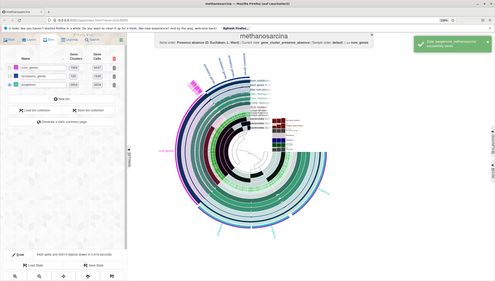
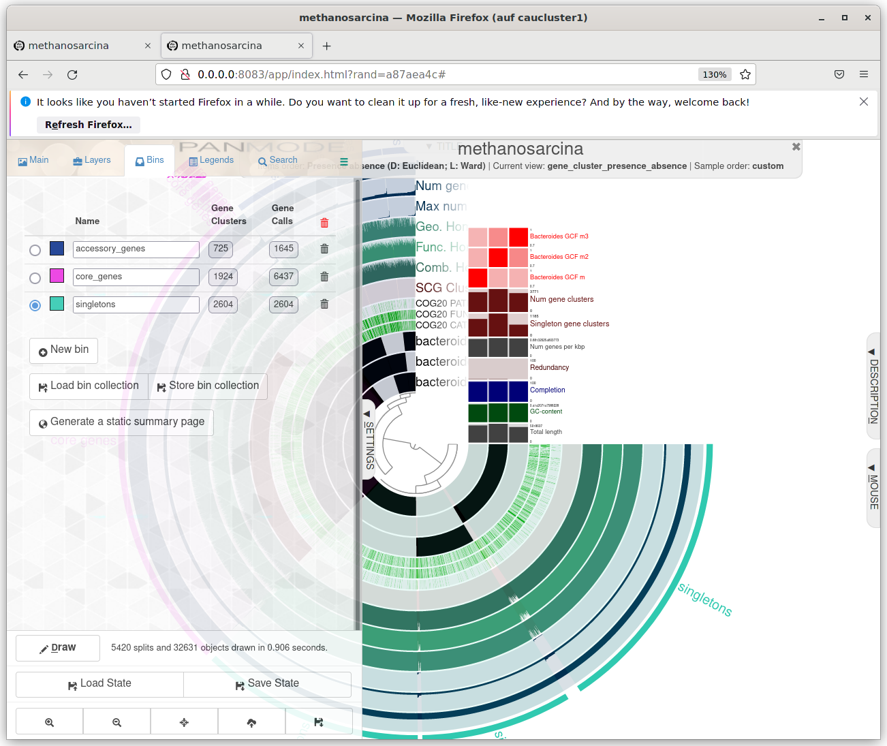

# day 7 
```bash
#dann:
squeue -u sunam229
sbatch template.sh
#we will compare  genomes  using Anvio. We will create a pangenome and visualize it. We will also look at the completeness of the genomes and the contamination of the genomes.
# 1. you have to load the environment 
# 2. download the data 
# 3. create contigs.dbs from .fasta files 
# 4. visualize contigs.db 
# 5. create external genome file
# 6. investigate contamination 
# 7. visualise contigs for refinement 
# 8. splitting the genome in our good bins 
# 9. estimate completeness of split vs. unsplit genome 
# 10. compute pangenome 
# 11. display the pangenome 
# 12. computing phylogenomics for your pangenome 


# 1 : 
mkdir pangenomics 
#then
#!/bin/bash
#SBATCH --nodes=1
#SBATCH --cpus-per-task=16
#SBATCH --mem=32G
#SBATCH --time=2:00:00
#SBATCH --job-name=anvio_pangenomics
#SBATCH --output=anvio_pangenomics.out
#SBATCH --error=anvio_pangenomics.err
#SBATCH --partition=base
#SBATCH --reservation=biol217

module load gcc12-env/12.1.0
module load micromamba/1.4.2
cd $WORK
micromamba activate .micromamba/envs/00_anvio/

# create new folder
mkdir $WORK/pangenomics/01_anvio_pangenomics

# 2:
curl -L https://ndownloader.figshare.com/files/28965090 -o V_jascida_genomes.tar.gz
tar -zxvf V_jascida_genomes.tar.gz
ls V_jascida_genomes

#3. 
#!/bin/bash
#SBATCH --nodes=1
#SBATCH --cpus-per-task=16
#SBATCH --mem=32G
#SBATCH --time=2:00:00
#SBATCH --job-name=pangenomicsloop
#SBATCH --output=pangenomicsloop.out
#SBATCH --error=pangenomicsloop.err
#SBATCH --partition=base
#SBATCH --reservation=biol217

module load gcc12-env/12.1.0
module load micromamba/1.4.2
eval "$(micromamba shell hook --shell=bash)"
cd $WORK
micromamba activate .micromamba/envs/00_anvio/

cd $WORK/pangenomics/pangenomics_test/V_jascida_genomes/

ls *fasta | awk 'BEGIN{FS="_"}{print $1}' > genomes.txt

# remove all contigs <2500 nt
for g in `cat genomes.txt`
do
    echo
    echo "Working on $g ..."
    echo
    anvi-script-reformat-fasta ${g}_scaffolds.fasta \
                               --min-len 2500 \
                               --simplify-names \
                               -o ${g}_scaffolds_2.5K.fasta
done

# generate contigs.db
for g in `cat genomes.txt`
do
    echo
    echo "Working on $g ..."
    echo
    anvi-gen-contigs-database -f ${g}_scaffolds_2.5K.fasta \
                              -o V_jascida_${g}.db \
                              --num-threads 4 \
                              -n V_jascida_${g}
done

# annotate contigs.db
for g in *.db
do
    anvi-run-hmms -c $g --num-threads 4
    anvi-run-ncbi-cogs -c $g --num-threads 4
    anvi-scan-trnas -c $g --num-threads 4
    anvi-run-scg-taxonomy -c $g --num-threads 4
done


#4:
#!/bin/bash
#SBATCH --nodes=1
#SBATCH --cpus-per-task=16
#SBATCH --mem=32G
#SBATCH --time=2:00:00
#SBATCH --job-name=visualizecontigs
#SBATCH --output=visualizecontigs.out
#SBATCH --error=visualizecontigs.err
#SBATCH --partition=base
#SBATCH --reservation=biol217

module load gcc12-env/12.1.0
module load micromamba/1.4.2
cd $WORK
micromamba activate .micromamba/envs/00_anvio/

anvi-display-contigs-stats $WORK/pangenomics/pangenomics_test/V_jascida_genomes/*db

#then
srun --pty --x11 --partition=interactive --nodes=1 --tasks-per-node=1 --cpus-per-task=1 --mem=10G --time=01:00:00 /bin/bash

#then open in a new terminal : 
ssh -L 8080:localhost:8080 sunam229@caucluster.rz.uni-kiel.de

ssh -L 8080:localhost:8080 n100


#5 :
eval "$(micromamba shell hook --shell=bash)"

anvi-script-gen-genomes-file --input-dir $WORK/pangenomics/pangenomics_test/V_jascida_genomes/ -o external_genomes.txt

# 6:
cd $WORK/pangenomics/pangenomics_test/V_jascida_genomes
anvi-estimate-genome-completeness -e $WORK/pangenomics/pangenomics_test/external_genomes.txt

#7:
anvi-profile -c V_jascida_52.db \
             --sample-name V_jascida_52 \
             --output-dir V_jascida_52 \
             --blank


srun --pty --mem=10G --nodes=1 --tasks-per-node=1 --cpus-per-task=1 --partition=base /bin/bash

module load gcc12-env/12.1.0
module load micromamba/1.4.2
cd $WORK
micromamba activate .micromamba/envs/00_anvio/

anvi-interactive -c V_jascida_52.db / -p V_jascida_52/PROFILE.db


#10
cd $WORK
micromamba activate .micromamba/envs/00_anvio/

cd $WORK/pangenomics/pangenomics_test/V_jascida_genomes/

anvi-gen-genomes-storage -e external_genomes.txt -o V_jascida-GENOMES.db

anvi-pan-genome -g V_jascida-GENOMES.db --project-name V_jascida --num-threads 4   

#11

srun --pty --mem=10G --nodes=1 --tasks-per-node=1 --cpus-per-task=1 --partition=base /bin/bash
module load gcc12-env/12.1.0
module load micromamba/1.4.2
cd $WORK
micromamba activate .micromamba/envs/00_anvio/
cd $WORK/pangenomics/pangenome2/m_genomes/methanosarcina
anvi-display-pan -p methanosarcina-PAN.db -g methanosarcina-GENOMES.db


ssh -L 8080:localhost:8080 sunam229@caucluster.rz.uni-kiel.de
ssh -L 8080:localhost:8080 n100


#redoit on your own:
#download 3-5 fasta files from the same genus -> best also species 
#create a pangenome in a seperate folder
#analyse the pangeno
#Protoko: methodes to use for downloads, why i choosed this genomes and and and 


#download genomes and put them in a folder
#convert into fasta 
#1- rename files
for file in *.fna; do mv "$file" "${file%.fna}.fasta"; done


#then loop
#!/bin/bash
#SBATCH --nodes=1
#SBATCH --cpus-per-task=16
#SBATCH --mem=32G
#SBATCH --time=2:00:00
#SBATCH --job-name=methanoloop
#SBATCH --output=methanoloop.out
#SBATCH --error=methanoloop.err
#SBATCH --partition=base
#SBATCH --reservation=biol217


module load gcc12-env/12.1.0
module load micromamba/1.4.2
eval "$(micromamba shell hook --shell=bash)"
cd $WORK
micromamba activate .micromamba/envs/00_anvio/

# go to your folder where you have all the genomes
cd $WORK/pangenomics/pangenome2/m_genomes/


#2- Fast files to contigs DBs
#put genome into text file to make for loop
ls *fasta | awk 'BEGIN{FS="."}{print $1}' > genomes.txt
# reformat fasta files
for g in `cat genomes.txt`
do
    echo
    echo "Working on $g ..."
    echo
    anvi-script-reformat-fasta ${g}.fasta \
                               --min-len 2500 \
                               --simplify-names \
                               -o ${g}_2.5K.fasta
done

# Get the number of CPU cores
threads=12
name="bacteroides"

#convert into contigs dbs
for g in `cat genomes.txt`
do
    echo
    echo "Working on $g ..." 
    echo
    anvi-gen-contigs-database -f ${g}_2.5K.fasta \
                              -o ${name}_${g}.db \
                              --num-threads $threads \
                              -n ${name}_${g}
done


#3- annotating contigs db
for g in *.db
do
    anvi-run-hmms -c $g --num-threads $threads
    anvi-run-ncbi-cogs -c $g --num-threads $threads
    anvi-scan-trnas -c $g --num-threads $threads
    anvi-run-scg-taxonomy -c $g --num-threads $threads
done


module load gcc12-env/12.1.0
module load micromamba/1.4.2
eval "$(micromamba shell hook --shell=bash)"
cd $WORK
micromamba activate .micromamba/envs/00_anvio/

# go to your folder where you have all the genomes
cd $WORK/pangenomics/pangenome2/m_genomes/


#2- Fast files to contigs DBs
#put genome into text file to make for loop
ls *fasta | awk 'BEGIN{FS="."}{print $1}' > genomes.txt
# reformat fasta files
for g in `cat genomes.txt`
do
    echo
    echo "Working on $g ..."
    echo
    anvi-script-reformat-fasta ${g}.fasta \
                               --min-len 2500 \
                               --simplify-names \
                               -o ${g}_2.5K.fasta
done

# Get the number of CPU cores
threads=12
name="methanosarcina"

#convert into contigs dbs
for g in `cat genomes.txt`
do
    echo
    echo "Working on $g ..." 
    echo
    anvi-gen-contigs-database -f ${g}_2.5K.fasta \
                              -o ${name}_${g}.db \
                              --num-threads $threads \
                              -n ${name}_${g}
done


#then : 
#4- creating an external genome file
   anvi-script-gen-genomes-file --input-dir $WORK/pangenomics/pangenome2/m_genomes/ -o external_genomes.txt       


   #then    5:


 #5- Estimating contamination
anvi-estimate-genome-completeness -e external-genomes.txt
# check if refinement needed or turn off this    
#completness:          96.05    /  97.37

#then: 

#6- computing a pangenome
cd $WORK
micromamba activate .micromamba/envs/00_anvio/

cd $WORK/pangenomics/pangenome2/m_genomes/

anvi-gen-genomes-storage -e external_genomes.txt -o methanosarcina-GENOMES.db

anvi-pan-genome -g methanosarcina.db --project-name methanosarcina --num-threads 4   

#then visualise your genome:
srun --pty --mem=10G --nodes=1 --tasks-per-node=1 --cpus-per-task=1 --partition=base /bin/bash
module load gcc12-env/12.1.0
module load micromamba/1.4.2
cd $WORK
micromamba activate .micromamba/envs/00_anvio/
cd $WORK/pangenomics/pangenome2/m_genomes/methanosarcina
anvi-display-pan -p methanosarcina-PAN.db -g methanosarcina-GENOMES.db


```





```bash


#then:
#7- calculating average nucleotide identity ANI
anvi-compute-genome-similarity --external-genomes external_genomes.txt --program pyANI --output-dir ANI  --num-threads 12 $threads --pan-db ${name}/${name}-PAN.db 


#8- phylogenomic tree
anvi-get-sequences-for-gene-clusters -p ${name}/${name}-PAN.db \
                                     -g ${name}-GENOMES.db \
                                     --min-num-genomes-gene-cluster-occurs 4 \
                                     --max-num-genes-from-each-genome 1 \
                                     --concatenate-gene-clusters \
                                     --output-file ${name}/${name}-SCGs.fa

trimal -in ${name}/${name}-SCGs.fa \
         -out ${name}/${name}-SCGs-clean.fa \
         -gt 0.5

iqtree -s ${name}/${name}-SCGs-clean.fa \
       -m WAG \
       -bb 1000 \
       -nt $threads