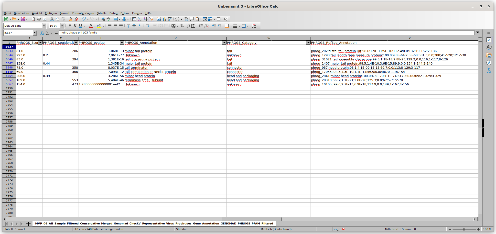
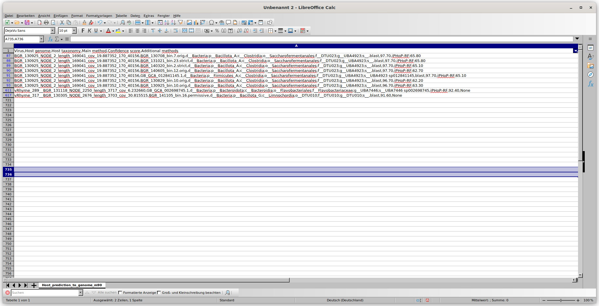

```bash
   # How many viruses are in the BGR_140717 sample

   # Hint look into folder 01_GENOMAD and find the *.fna virus files. Use grep “?”
grep ">" -c 01_GENOMAD/BGR_140717/BGR_140717_Proviruses_Genomad_Output/proviruses_summary/proviruses_virus.fna

grep ">" -c 01_GENOMAD/BGR_140717/BGR_140717_Viruses_Genomad_Output/BGR_140717_modified_summary/BGR_140717_modified_virus.fna
# 11 for proviruses and 846 for the other 


#
  #  How many Caudoviricetes viruses in the BGR_*/ sample? Any other viral taxonomies?

   # Briefly look up and describe these viruses (ds/ss DNA/RNA and hosts (euk/prok)

    #How many High-quality and complete viruses in the BGR_*/ sample

   # Hint look into folder 02_CHECKV and find the MVP_02_BGR_***_Filtered_Relaxed_Merged_Genomad_CheckV_Virus_Proviruses_Quality_Summary.tsv files. Use grep “?” -?
grep -c "Caudoviricetes" 02_CHECK_V/BGR_*/MVP_02_BGR_*_Filtered_Relaxed_Merged_Genomad_CheckV_Virus_Proviruses_Quality_Summary.tsv

#02_CHECK_V/BGR_130305/MVP_02_BGR_130305_Filtered_Relaxed_Merged_Genomad_CheckV_Virus_Proviruses_Quality_Summary.tsv:614
#02_CHECK_V/BGR_130527/MVP_02_BGR_130527_Filtered_Relaxed_Merged_Genomad_CheckV_Virus_Proviruses_Quality_Summary.tsv:684
#02_CHECK_V/BGR_130708/MVP_02_BGR_130708_Filtered_Relaxed_Merged_Genomad_CheckV_Virus_Proviruses_Quality_Summary.tsv:850
#02_CHECK_V/BGR_130829/MVP_02_BGR_130829_Filtered_Relaxed_Merged_Genomad_CheckV_Virus_Proviruses_Quality_Summary.tsv:954
#02_CHECK_V/BGR_130925/MVP_02_BGR_130925_Filtered_Relaxed_Merged_Genomad_CheckV_Virus_Proviruses_Quality_Summary.tsv:849
#02_CHECK_V/BGR_131021/MVP_02_BGR_131021_Filtered_Relaxed_Merged_Genomad_CheckV_Virus_Proviruses_Quality_Summary.tsv:1079
#02_CHECK_V/BGR_131118/MVP_02_BGR_131118_Filtered_Relaxed_Merged_Genomad_CheckV_Virus_Proviruses_Quality_Summary.tsv:609
#02_CHECK_V/BGR_140106/MVP_02_BGR_140106_Filtered_Relaxed_Merged_Genomad_CheckV_Virus_Proviruses_Quality_Summary.tsv:368
#02_CHECK_V/BGR_140121/MVP_02_BGR_140121_Filtered_Relaxed_Merged_Genomad_CheckV_Virus_Proviruses_Quality_Summary.tsv:575
#02_CHECK_V/BGR_140221/MVP_02_BGR_140221_Filtered_Relaxed_Merged_Genomad_CheckV_Virus_Proviruses_Quality_Summary.tsv:717
#02_CHECK_V/BGR_140320/MVP_02_BGR_140320_Filtered_Relaxed_Merged_Genomad_CheckV_Virus_Proviruses_Quality_Summary.tsv:468
#02_CHECK_V/BGR_140423/MVP_02_BGR_140423_Filtered_Relaxed_Merged_Genomad_CheckV_Virus_Proviruses_Quality_Summary.tsv:358
#02_CHECK_V/BGR_140605/MVP_02_BGR_140605_Filtered_Relaxed_Merged_Genomad_CheckV_Virus_Proviruses_Quality_Summary.tsv:527
#02_CHECK_V/BGR_140717/MVP_02_BGR_140717_Filtered_Relaxed_Merged_Genomad_CheckV_Virus_Proviruses_Quality_Summary.tsv:559
#02_CHECK_V/BGR_140821/MVP_02_BGR_140821_Filtered_Relaxed_Merged_Genomad_CheckV_Virus_Proviruses_Quality_Summary.tsv:337
#02_CHECK_V/BGR_140919/MVP_02_BGR_140919_Filtered_Relaxed_Merged_Genomad_CheckV_Virus_Proviruses_Quality_Summary.tsv:476
#02_CHECK_V/BGR_141022/MVP_02_BGR_141022_Filtered_Relaxed_Merged_Genomad_CheckV_Virus_Proviruses_Quality_Summary.tsv:401
#02_CHECK_V/BGR_150108/MVP_02_BGR_150108_Filtered_Relaxed_Merged_Genomad_CheckV_Virus_Proviruses_Quality_Summary.tsv:339
grep -c "Unclassified" 02_CHECK_V/BGR_*/MVP_02_BGR_*_Filtered_Relaxed_Merged_Genomad_CheckV_Virus_Proviruses_Quality_Summary.tsv
02_CHECK_V/BGR_130305/MVP_02_BGR_130305_Filtered_Relaxed_Merged_Genomad_CheckV_Virus_Proviruses_Quality_Summary.tsv:10
02_CHECK_V/BGR_130527/MVP_02_BGR_130527_Filtered_Relaxed_Merged_Genomad_CheckV_Virus_Proviruses_Quality_Summary.tsv:9
02_CHECK_V/BGR_130708/MVP_02_BGR_130708_Filtered_Relaxed_Merged_Genomad_CheckV_Virus_Proviruses_Quality_Summary.tsv:10
02_CHECK_V/BGR_130829/MVP_02_BGR_130829_Filtered_Relaxed_Merged_Genomad_CheckV_Virus_Proviruses_Quality_Summary.tsv:14
02_CHECK_V/BGR_130925/MVP_02_BGR_130925_Filtered_Relaxed_Merged_Genomad_CheckV_Virus_Proviruses_Quality_Summary.tsv:11
02_CHECK_V/BGR_131021/MVP_02_BGR_131021_Filtered_Relaxed_Merged_Genomad_CheckV_Virus_Proviruses_Quality_Summary.tsv:14
02_CHECK_V/BGR_131118/MVP_02_BGR_131118_Filtered_Relaxed_Merged_Genomad_CheckV_Virus_Proviruses_Quality_Summary.tsv:7
02_CHECK_V/BGR_140106/MVP_02_BGR_140106_Filtered_Relaxed_Merged_Genomad_CheckV_Virus_Proviruses_Quality_Summary.tsv:4
02_CHECK_V/BGR_140121/MVP_02_BGR_140121_Filtered_Relaxed_Merged_Genomad_CheckV_Virus_Proviruses_Quality_Summary.tsv:4
02_CHECK_V/BGR_140221/MVP_02_BGR_140221_Filtered_Relaxed_Merged_Genomad_CheckV_Virus_Proviruses_Quality_Summary.tsv:8
02_CHECK_V/BGR_140320/MVP_02_BGR_140320_Filtered_Relaxed_Merged_Genomad_CheckV_Virus_Proviruses_Quality_Summary.tsv:4
02_CHECK_V/BGR_140423/MVP_02_BGR_140423_Filtered_Relaxed_Merged_Genomad_CheckV_Virus_Proviruses_Quality_Summary.tsv:4
02_CHECK_V/BGR_140605/MVP_02_BGR_140605_Filtered_Relaxed_Merged_Genomad_CheckV_Virus_Proviruses_Quality_Summary.tsv:7
02_CHECK_V/BGR_140717/MVP_02_BGR_140717_Filtered_Relaxed_Merged_Genomad_CheckV_Virus_Proviruses_Quality_Summary.tsv:9
02_CHECK_V/BGR_140821/MVP_02_BGR_140821_Filtered_Relaxed_Merged_Genomad_CheckV_Virus_Proviruses_Quality_Summary.tsv:4
02_CHECK_V/BGR_140919/MVP_02_BGR_140919_Filtered_Relaxed_Merged_Genomad_CheckV_Virus_Proviruses_Quality_Summary.tsv:8
02_CHECK_V/BGR_141022/MVP_02_BGR_141022_Filtered_Relaxed_Merged_Genomad_CheckV_Virus_Proviruses_Quality_Summary.tsv:8
02_CHECK_V/BGR_150108/MVP_02_BGR_150108_Filtered_Relaxed_Merged_Genomad_CheckV_Virus_Proviruses_Quality_Summary.tsv:10

#quality for the sample BGR_140717:
# 3 with medium-quality the rest has low quality 


#Caudoviricetes; infects bacterias and viruses ; capsid with tail ; ss DNA 


#**How many Low-Quality/Medium-quality/High-quality/Complete
grep -c "Low-quality" 02_CHECK_V/BGR_*/MVP_02_BGR_*_Filtered_Relaxed_Merged_Genomad_CheckV_Virus_Proviruses_Quality_Summary.tsv

02_CHECK_V/BGR_130305/MVP_02_BGR_130305_Filtered_Relaxed_Merged_Genomad_CheckV_Virus_Proviruses_Quality_Summary.tsv:625
02_CHECK_V/BGR_130527/MVP_02_BGR_130527_Filtered_Relaxed_Merged_Genomad_CheckV_Virus_Proviruses_Quality_Summary.tsv:693
02_CHECK_V/BGR_130708/MVP_02_BGR_130708_Filtered_Relaxed_Merged_Genomad_CheckV_Virus_Proviruses_Quality_Summary.tsv:860
02_CHECK_V/BGR_130829/MVP_02_BGR_130829_Filtered_Relaxed_Merged_Genomad_CheckV_Virus_Proviruses_Quality_Summary.tsv:964
02_CHECK_V/BGR_130925/MVP_02_BGR_130925_Filtered_Relaxed_Merged_Genomad_CheckV_Virus_Proviruses_Quality_Summary.tsv:856
02_CHECK_V/BGR_131021/MVP_02_BGR_131021_Filtered_Relaxed_Merged_Genomad_CheckV_Virus_Proviruses_Quality_Summary.tsv:1091
02_CHECK_V/BGR_131118/MVP_02_BGR_131118_Filtered_Relaxed_Merged_Genomad_CheckV_Virus_Proviruses_Quality_Summary.tsv:613
02_CHECK_V/BGR_140106/MVP_02_BGR_140106_Filtered_Relaxed_Merged_Genomad_CheckV_Virus_Proviruses_Quality_Summary.tsv:372
02_CHECK_V/BGR_140121/MVP_02_BGR_140121_Filtered_Relaxed_Merged_Genomad_CheckV_Virus_Proviruses_Quality_Summary.tsv:578
02_CHECK_V/BGR_140221/MVP_02_BGR_140221_Filtered_Relaxed_Merged_Genomad_CheckV_Virus_Proviruses_Quality_Summary.tsv:724
02_CHECK_V/BGR_140320/MVP_02_BGR_140320_Filtered_Relaxed_Merged_Genomad_CheckV_Virus_Proviruses_Quality_Summary.tsv:471
02_CHECK_V/BGR_140423/MVP_02_BGR_140423_Filtered_Relaxed_Merged_Genomad_CheckV_Virus_Proviruses_Quality_Summary.tsv:362
02_CHECK_V/BGR_140605/MVP_02_BGR_140605_Filtered_Relaxed_Merged_Genomad_CheckV_Virus_Proviruses_Quality_Summary.tsv:531
02_CHECK_V/BGR_140717/MVP_02_BGR_140717_Filtered_Relaxed_Merged_Genomad_CheckV_Virus_Proviruses_Quality_Summary.tsv:564
02_CHECK_V/BGR_140821/MVP_02_BGR_140821_Filtered_Relaxed_Merged_Genomad_CheckV_Virus_Proviruses_Quality_Summary.tsv:338
02_CHECK_V/BGR_140919/MVP_02_BGR_140919_Filtered_Relaxed_Merged_Genomad_CheckV_Virus_Proviruses_Quality_Summary.tsv:485
02_CHECK_V/BGR_141022/MVP_02_BGR_141022_Filtered_Relaxed_Merged_Genomad_CheckV_Virus_Proviruses_Quality_Summary.tsv:409
02_CHECK_V/BGR_150108/MVP_02_BGR_150108_Filtered_Relaxed_Merged_Genomad_CheckV_Virus_Proviruses_Quality_Summary.tsv:348

grep -c "Medium-quality" 02_CHECK_V/BGR_*/MVP_02_BGR_*_Filtered_Relaxed_Merged_Genomad_CheckV_Virus_Proviruses_Quality_Summary.tsv

02_CHECK_V/BGR_130305/MVP_02_BGR_130305_Filtered_Relaxed_Merged_Genomad_CheckV_Virus_Proviruses_Quality_Summary.tsv:0
02_CHECK_V/BGR_130527/MVP_02_BGR_130527_Filtered_Relaxed_Merged_Genomad_CheckV_Virus_Proviruses_Quality_Summary.tsv:1
02_CHECK_V/BGR_130708/MVP_02_BGR_130708_Filtered_Relaxed_Merged_Genomad_CheckV_Virus_Proviruses_Quality_Summary.tsv:1
02_CHECK_V/BGR_130829/MVP_02_BGR_130829_Filtered_Relaxed_Merged_Genomad_CheckV_Virus_Proviruses_Quality_Summary.tsv:3
02_CHECK_V/BGR_130925/MVP_02_BGR_130925_Filtered_Relaxed_Merged_Genomad_CheckV_Virus_Proviruses_Quality_Summary.tsv:3
02_CHECK_V/BGR_131021/MVP_02_BGR_131021_Filtered_Relaxed_Merged_Genomad_CheckV_Virus_Proviruses_Quality_Summary.tsv:3
02_CHECK_V/BGR_131118/MVP_02_BGR_131118_Filtered_Relaxed_Merged_Genomad_CheckV_Virus_Proviruses_Quality_Summary.tsv:3
02_CHECK_V/BGR_140106/MVP_02_BGR_140106_Filtered_Relaxed_Merged_Genomad_CheckV_Virus_Proviruses_Quality_Summary.tsv:0
02_CHECK_V/BGR_140121/MVP_02_BGR_140121_Filtered_Relaxed_Merged_Genomad_CheckV_Virus_Proviruses_Quality_Summary.tsv:0
02_CHECK_V/BGR_140221/MVP_02_BGR_140221_Filtered_Relaxed_Merged_Genomad_CheckV_Virus_Proviruses_Quality_Summary.tsv:1
02_CHECK_V/BGR_140320/MVP_02_BGR_140320_Filtered_Relaxed_Merged_Genomad_CheckV_Virus_Proviruses_Quality_Summary.tsv:1
02_CHECK_V/BGR_140423/MVP_02_BGR_140423_Filtered_Relaxed_Merged_Genomad_CheckV_Virus_Proviruses_Quality_Summary.tsv:0
02_CHECK_V/BGR_140605/MVP_02_BGR_140605_Filtered_Relaxed_Merged_Genomad_CheckV_Virus_Proviruses_Quality_Summary.tsv:2
02_CHECK_V/BGR_140717/MVP_02_BGR_140717_Filtered_Relaxed_Merged_Genomad_CheckV_Virus_Proviruses_Quality_Summary.tsv:3
02_CHECK_V/BGR_140821/MVP_02_BGR_140821_Filtered_Relaxed_Merged_Genomad_CheckV_Virus_Proviruses_Quality_Summary.tsv:1
02_CHECK_V/BGR_140919/MVP_02_BGR_140919_Filtered_Relaxed_Merged_Genomad_CheckV_Virus_Proviruses_Quality_Summary.tsv:1
02_CHECK_V/BGR_141022/MVP_02_BGR_141022_Filtered_Relaxed_Merged_Genomad_CheckV_Virus_Proviruses_Quality_Summary.tsv:0
02_CHECK_V/BGR_150108/MVP_02_BGR_150108_Filtered_Relaxed_Merged_Genomad_CheckV_Virus_Proviruses_Quality_Summary.tsv:1

grep -c "High-quality" 02_CHECK_V/BGR_*/MVP_02_BGR_*_Filtered_Relaxed_Merged_Genomad_CheckV_Virus_Proviruses_Quality_Summary.tsv
02_CHECK_V/BGR_130305/MVP_02_BGR_130305_Filtered_Relaxed_Merged_Genomad_CheckV_Virus_Proviruses_Quality_Summary.tsv:0
02_CHECK_V/BGR_130527/MVP_02_BGR_130527_Filtered_Relaxed_Merged_Genomad_CheckV_Virus_Proviruses_Quality_Summary.tsv:0
02_CHECK_V/BGR_130708/MVP_02_BGR_130708_Filtered_Relaxed_Merged_Genomad_CheckV_Virus_Proviruses_Quality_Summary.tsv:0
02_CHECK_V/BGR_130829/MVP_02_BGR_130829_Filtered_Relaxed_Merged_Genomad_CheckV_Virus_Proviruses_Quality_Summary.tsv:0
02_CHECK_V/BGR_130925/MVP_02_BGR_130925_Filtered_Relaxed_Merged_Genomad_CheckV_Virus_Proviruses_Quality_Summary.tsv:0
02_CHECK_V/BGR_131021/MVP_02_BGR_131021_Filtered_Relaxed_Merged_Genomad_CheckV_Virus_Proviruses_Quality_Summary.tsv:1
02_CHECK_V/BGR_131118/MVP_02_BGR_131118_Filtered_Relaxed_Merged_Genomad_CheckV_Virus_Proviruses_Quality_Summary.tsv:0
02_CHECK_V/BGR_140106/MVP_02_BGR_140106_Filtered_Relaxed_Merged_Genomad_CheckV_Virus_Proviruses_Quality_Summary.tsv:0
02_CHECK_V/BGR_140121/MVP_02_BGR_140121_Filtered_Relaxed_Merged_Genomad_CheckV_Virus_Proviruses_Quality_Summary.tsv:1
02_CHECK_V/BGR_140221/MVP_02_BGR_140221_Filtered_Relaxed_Merged_Genomad_CheckV_Virus_Proviruses_Quality_Summary.tsv:1
02_CHECK_V/BGR_140320/MVP_02_BGR_140320_Filtered_Relaxed_Merged_Genomad_CheckV_Virus_Proviruses_Quality_Summary.tsv:0
02_CHECK_V/BGR_140423/MVP_02_BGR_140423_Filtered_Relaxed_Merged_Genomad_CheckV_Virus_Proviruses_Quality_Summary.tsv:0
02_CHECK_V/BGR_140605/MVP_02_BGR_140605_Filtered_Relaxed_Merged_Genomad_CheckV_Virus_Proviruses_Quality_Summary.tsv:0
02_CHECK_V/BGR_140717/MVP_02_BGR_140717_Filtered_Relaxed_Merged_Genomad_CheckV_Virus_Proviruses_Quality_Summary.tsv:1
02_CHECK_V/BGR_140821/MVP_02_BGR_140821_Filtered_Relaxed_Merged_Genomad_CheckV_Virus_Proviruses_Quality_Summary.tsv:1
02_CHECK_V/BGR_140919/MVP_02_BGR_140919_Filtered_Relaxed_Merged_Genomad_CheckV_Virus_Proviruses_Quality_Summary.tsv:0
02_CHECK_V/BGR_141022/MVP_02_BGR_141022_Filtered_Relaxed_Merged_Genomad_CheckV_Virus_Proviruses_Quality_Summary.tsv:0
02_CHECK_V/BGR_150108/MVP_02_BGR_150108_Filtered_Relaxed_Merged_Genomad_CheckV_Virus_Proviruses_Quality_Summary.tsv:0


  #  **What is the length of the complete virus? How many viral hallmark genes?
  
# the Caudoviricetes have a genome size of 18 - 500 kBA 
# complete with high quality  31258, 10 hallmark genes 
#BGR_140821 has a lenghs of 66020 (high quality); 3 hallmark genes 


#  **Check how abundant is your complete virus in the different samples (RPKM)? Look into folders 04_READ_MAPPING/Subfolders/BGR_*_CoverM.tsv and find your viruses.

 #   **Create a table and summarize the RPKM value of the virus in the different samples. Or look into folder 05_VOTU_TABLES

 RPKM for sample xxx
 in BGR_13030     197.46283
 in BGR_13052     161.75777
 in BGR_13070     113.52365
 in BGR_13082     43.803528
 in BGR_13092     46.017822
 in BGR_13102     6.9410787
 in BGR_13111     3.3950949
 in BGR_14012     3.1058502
 in BGR_14012     292.06485
 in BGR_14022     46.794453
 in BGR_14032     153.9964
 in BGR_14042     3.3980339
 in BGR_14060     2.0616696
 in BGR_14071     305.86407
 in BGR_14082     85.26142
 in BGR_14091     130.4371
 in BGR_14102     154.94527
 in BGR_15010     194.18689

   # Now let’s look at annotated genes in 06_FUNCTIONAL_ANNOTATION and find the table: MVP_06_All_Sample_Filtered_Conservative_Merged_Genomad_CheckV_Representative_Virus_Proviruses_Gene_Annotation_GENOMAD_PHROGS_PFAM_Filtered.tsv

   # Now find/filter your complete virus and find the viral hallmark genes with a PHROG annotation (hint: look at the columns).


   ```
   

   

   ```bash

   # **What are typical annotations you see? What could the functions be?

phrog categorie               phrog annotations
tail:                         minor tail protein
unknown                       unknown
tail                          tail chaperon protein
tail                          major tail protein
connector                     tail terminator
connector                     tail compleation or neck 1 protein
head and packaging            minor head protein
head and packaging            terminase smal subunit 
unknown                       unknown

   # **Now look for the category of “moron, auxiliary metabolic gene and host takeover” any toxin genes???? Quickly look up the function of this toxin (hint, vibrio phage and vibrio cholerae host)

   zot-like toxin 
   its an toxin provided by a prohage (enterotoxin). Zot, the zonula occludens toxin encoded by the Vibrio cholerae phage CTXϕ. 
   increases intestinal permeability by interacting with a mammalian cell receptor with subsequent activation of intracellular signaling leading to the disassembly of the intercellular tight junctions.


#*Now let’s look at the binning results. Look at 07_BINNING/07C_vBINS_READ_MAPPING/ and find table MVP_07_Merged_vRhyme_Outputs_Unfiltered_best_vBins_Memberships_geNomad_CheckV_Summary_read_mapping_information_RPKM_Table.tsv
   # How many High-quality viruses after binning in comparison to before binning? (hint: look carefully at the table, it has duplicate entries for bins) 
     9 high quality bins after binning and before binning 5 

  #  **Are any of the identified viral contigs complete circular genomes (based on identifying direct terminal repeat regions on both ends of the genome)? 
yes but only one 

#*You can also look at the table 07D_vBINS_vOTUS_TABLES and find table: #MVP_07_Merged_vRhyme_Outputs_Filtered_conservative_best_vBins_Representative_Unbinned_vOTUs_geNomad_CheckV_Summary_read_mapping_information_RPKM_Table.tsv

#*Now finally let’s have a look at the potential predicted host of these complete viruses. *Look into folder 08_iPHoP and find table: Host_prediction_to_genome_m90.csv

   # **What are the predicted hosts for your complete virus? are there multiple predicted hosts? are the hosts distantly related?
   Virus,Host genome,Host taxonomy,Main method,Confidence score,Additional methods
BGR_140717_NODE_168_length_31258_cov_37.020094,BGR_130829_bin.14.strict,d__Bacteria;p__Bacillota_A;c__Clostridia;o__Tissierellales;f__Peptoniphilaceae;g__;s__,blast,90.50,iPHoP-RF;78.00

   # if not find 2 examples of viruses with multiple hosts predicted. for virus 1 closely related hosts and for virus 2 distantly related hosts.

```



```bash
   
   # Discuss what might be the reasons based on 1) biological reasoning, 2) the prediction method or 3) potential contamination in host MAG that migh result in such a prediction.
biological reasons: the virus might infect multiple host and is not highly specific; due to a lateral Gentransfer between different bacteria species (genes or CRISPR)
prediction method: the method is only as good as the database it uses. a lot of microorganisms are still uncultivable and there are only a few datas for some of them 
contamination a contamination in a host MAG could lead to a wrong host predicition. viruses only have a very smal genome so the host prediction is more likely to get affected by contaminations in the host MAG wchich can lead to a false prediction. 


-> phages can adapt to the codon usage to the host (doesn´t apply for all viruses)


-----------------------------------------------------------------------------------------------------------------------------------------------

# we didnt run the commands ourself because the data bases are very large and it would take a long time to run this. But this were the used commands: 
#MVP
module load gcc12-env/12.1.0
module load micromamba/1.3.1
micromamba activate MVP
cd $WORK/MVP_test
mvip MVP_00_set_up_MVP -i ./WORKING_DIRECTORY/ -m input_file_timeseries_final.csv  --genomad_db_path ./WORKING_DIRECTORY/00_DATABASES/genomad_db/ --checkv_db_path ./WORKING_DIRECTORY/00_DATABASES/checkv-db-v1.5/
mvip MVP_00_set_up_MVP -i ./WORKING_DIRECTORY/ -m input_file_timeseries_final.csv  --skip_install_databases
mvip MVP_01_run_genomad_checkv -i WORKING_DIRECTORY/ -m input_file_timeseries_final.csv
mvip MVP_02_filter_genomad_checkv -i WORKING_DIRECTORY/ -m input_file_timeseries_final.csv
mvip MVP_03_do_clustering -i WORKING_DIRECTORY/ -m input_file_timeseries_final.csv
mvip MVP_04_do_read_mapping -i WORKING_DIRECTORY/ -m input_file_timeseries_final.csv --delete_files
mvip MVP_05_create_vOTU_table -i WORKING_DIRECTORY/ -m input_file_timeseries_final.csv
mvip MVP_06_do_functional_annotation -i WORKING_DIRECTORY/ -m input_file_timeseries_final.csv
mvip MVP_07_do_binning -i WORKING_DIRECTORY/ -m input_file_timeseries_final.csv --force_outputs
mvip MVP_100_summarize_outputs -i WORKING_DIRECTORY/ -m input_file_timeseries_final.csv

#iPHoP
module load miniconda3/4.12.0
conda activate GTDBTk
export GTDBTK_DATA_PATH=./GTDB_db/GTDB_db

gtdbtk de_novo_wf --genome_dir fa_all/ \
--bacteria --outgroup_taxon p__Patescibacteria \
--out_dir output/ \
--cpus 12 --force --extension fa

gtdbtk de_novo_wf --genome_dir fa_all/ \
--archaea --outgroup_taxon p__Altarchaeota \
--out_dir output/ \
--cpus 12 --force --extension fa

module load micromamba/1.3.1
micromamba activate iphop_env
iphop add_to_db --fna_dir fa_all/ \
--gtdb_dir ./output/ \
--out_dir ./MAGs_iPHoP_db \
--db_dir iPHoP_db/

iphop predict --fa_file ./MVP_07_Filtered_conservative_Prokaryote_Host_Only_best_vBins_Representative_Unbinned_vOTUs_Sequences_iPHoP_Input.fasta \
--db_dir ./MAGs_iPHoP_db \
--out_dir ./iphop_output -t 12


