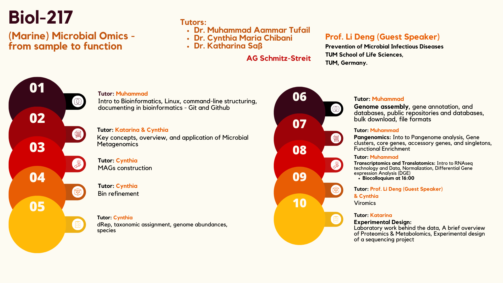

# day-1 protocol
## 20-01-2025
>highlight
- bullet
1. number

**bold**

*kursiv*

```bash
fastqc *.fastq
```
i use `fastq.gz` files for starting point.

[LinktoGithubrepository](https://github.com/)





